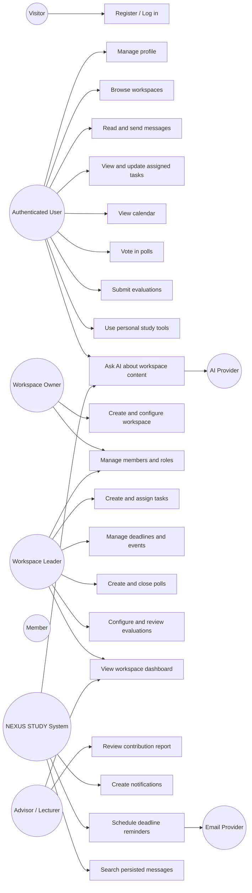
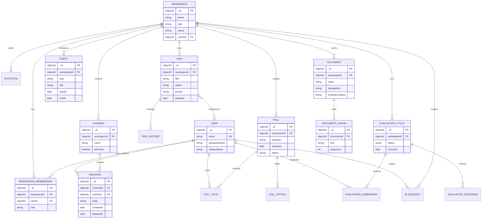

# NEXUS STUDY Product and System Specification

**Document status:** MVP baseline  
**Audience:** Product, UX, frontend, backend, QA, and academic supervisors  
**Primary stack:** React, Tailwind CSS or React Bootstrap, Node.js, Express.js, MongoDB, JWT

## 1. Product Vision

NEXUS STUDY is a focused digital workspace where university students can organize group learning and project work in one place: communicate, assign and complete work, manage deadlines, make group decisions, and review contribution fairly. Its AI assistant supports understanding and revision using workspace materials; it does not replace student judgment or authorship.

**Vision statement:** Help student groups do better work with less coordination overhead and clearer accountability.

**MVP success signals:**

- A group can create a workspace, invite members, and reach a shared dashboard without administrator help.
- Members can find current and historical chat, tasks, deadlines, and decisions in one workspace.
- A leader can see project progress and obtain a contribution report at the end of a project.
- Students can ask the AI about uploaded workspace documents and receive source-grounded answers.

## 2. Problem Statement

Student groups commonly split their work across chat applications, spreadsheets, cloud drives, calendars, and document editors. Important decisions disappear in chat, deadlines are missed, workload is uneven, and contribution is difficult to assess fairly. Existing tools are either general-purpose and fragmented or too complex for a small academic team.

NEXUS STUDY addresses this by providing one workspace with persistent communication, lightweight project management, deadlines, polls, peer evaluation, and a basic document-grounded learning assistant.

**MVP non-goals:** replacing a learning management system, replacing a document editor, providing institution-wide grading, building a full enterprise project-management suite, or automating academic authorship.

## 3. Target Users and Personas

### 3.1 Student member: Minh

Works on course assignments and a thesis. Needs a clear personal task list, deadline reminders, searchable decisions, and a fair way to show contribution. Low tolerance for setup and duplicate data entry.

### 3.2 Workspace leader: Lan

Coordinates a group of 4-8 students. Needs to invite members, assign work, monitor progress, schedule meetings, resolve decisions, and review contribution results.

### 3.3 Advisor or lecturer: Dr. An

Provides guidance to one or more groups. Needs read access to progress, files, discussions, and evaluation summaries without managing every task.

### 3.4 Tutor or small learning-center operator

Runs study groups or small classes. Needs reusable workspaces, basic progress visibility, and controlled access to learner activity.

### 3.5 Student club coordinator

Runs several projects or events. Needs separate workspaces with consistent roles, deadlines, and communication.

## 4. Actors

- **Visitor:** Unauthenticated person who can register or log in.
- **Authenticated user:** Any signed-in user with a profile and personal study tools.
- **Workspace owner:** Creator with full workspace administration rights.
- **Workspace leader:** Operational manager of a workspace.
- **Member:** Student who participates in work and communication.
- **Advisor/Lecturer:** Invited reviewer with limited or configurable access.
- **System:** NEXUS STUDY backend, notification scheduler, and access-control layer.
- **AI provider:** External AI API called through the backend; never directly by the browser.
- **Email provider:** Optional service for email notifications.
- **Google Calendar:** Future external calendar integration.

## 5. Functional Requirements

### Authentication and identity

- FR-01: Register with name, email, and password.
- FR-02: Log in and receive a short-lived JWT access token and refresh token strategy suitable for the deployment.
- FR-03: Log out and invalidate the active refresh session.
- FR-04: View and update profile information.
- FR-05: Restrict protected resources to authenticated users.
- FR-06: Enforce workspace-scoped roles and permissions.

### Workspace and membership

- FR-07: Create a workspace with name, type, description, and optional start/end dates.
- FR-08: View workspaces the user belongs to.
- FR-09: Invite a user by email or shareable invitation link with expiry.
- FR-10: Accept or decline an invitation.
- FR-11: Change a member role when authorized.
- FR-12: Remove or deactivate a member when authorized.
- FR-13: View a workspace dashboard with progress, upcoming deadlines, recent messages, and active polls.
- FR-14: Store workspace notes and a basic file-library record. Binary file storage may use local storage in development and object storage in deployment.
- FR-15: Update workspace settings or archive a workspace when authorized.

### Communication

- FR-16: Create and view workspace channels.
- FR-17: Send, edit, and soft-delete messages according to role policy.
- FR-18: Persist messages with author, channel, timestamps, and workspace identity.
- FR-19: Search message history within a workspace or channel.
- FR-20: Pin and unpin important messages when authorized.
- FR-21: Show unread counts and read status.
- FR-22: Show in-app notifications for mentions, assignments, invitations, and approaching deadlines.
- FR-23: Support private one-to-one chat only when both users share a workspace. Private chat is MVP optional if delivery time is constrained.

### Tasks and project management

- FR-24: Create, edit, archive, and view tasks.
- FR-25: Assign a task to one or more workspace members.
- FR-26: Set status (`TODO`, `DOING`, `DONE`), priority, description, due date, and attachments.
- FR-27: Move tasks between Kanban columns.
- FR-28: Filter tasks by status, assignee, priority, and due date.
- FR-29: Calculate workspace progress as completed tasks divided by total active tasks, with the formula displayed consistently in the UI.
- FR-30: Calculate member task progress from assigned active tasks; label it as task-based activity, not a quality score.
- FR-31: Keep an audit history for task status and assignment changes.

### Deadlines and calendar

- FR-32: Create, edit, and delete workspace events and deadlines.
- FR-33: Distinguish task deadlines, assignment deadlines, meetings, and other events.
- FR-34: Display month and agenda views.
- FR-35: Show countdown or relative time for the nearest important deadline.
- FR-36: Notify members about configured upcoming deadlines in-app and by email when enabled.

### Polls and decisions

- FR-37: Create a single-choice or multi-choice poll with options and closing time.
- FR-38: Restrict voting to workspace members.
- FR-39: Allow one vote per user per poll and permit vote changes only while the poll is open.
- FR-40: Display live or refreshed results according to the selected visibility setting.
- FR-41: Close a poll manually or automatically at its closing time.
- FR-42: Preserve the final result and creator decision context.

### Peer evaluation

- FR-43: Create an evaluation cycle for a workspace with deadline, criteria, and eligible participants.
- FR-44: Allow a member to submit self-evaluation and evaluations of eligible peers.
- FR-45: Support criteria such as task completion, responsibility, collaboration, attendance, quality, and communication.
- FR-46: Apply configurable numeric scales and optional comments.
- FR-47: Prevent duplicate submissions and prevent users evaluating themselves as peers.
- FR-48: Aggregate results using a documented average and normalization method.
- FR-49: Show reports to authorized leaders/advisors and optionally anonymized summaries to members.
- FR-50: Lock results after the cycle closes, with an authorized reopen action recorded in the audit log.

### Basic AI assistant

- FR-51: Upload or attach supported text-based documents to a workspace library.
- FR-52: Extract text and create searchable chunks with document ownership and access metadata.
- FR-53: Ask a question scoped to workspace documents.
- FR-54: Return an answer with document references where available and state when evidence is insufficient.
- FR-55: Summarize a selected document or workspace note.
- FR-56: Generate draft quizzes or flashcards from selected content for user review.
- FR-57: Never expose a document to a user who cannot access that document.
- FR-58: Record AI requests and usage metadata without storing unnecessary sensitive prompt content.

## 6. Non-Functional Requirements

- NFR-01 Security: Hash passwords with Argon2id or bcrypt; never store plaintext passwords.
- NFR-02 Security: Validate and authorize every workspace-scoped request on the server; do not trust client role claims.
- NFR-03 Security: Sanitize rendered message content and validate uploaded file type, size, and ownership.
- NFR-04 Privacy: A user can access only workspaces and documents they are authorized to access.
- NFR-05 Performance: Common dashboard and Kanban API responses should target under 500 ms at MVP test scale, excluding external AI calls.
- NFR-06 Reliability: API errors use a consistent JSON shape with an error code and request identifier.
- NFR-07 Availability: The MVP should recover from a process restart without losing persisted MongoDB data.
- NFR-08 Usability: Core flows must work on desktop and mobile browser widths with keyboard-accessible controls.
- NFR-09 Accessibility: Use semantic HTML, visible focus states, labels, sufficient contrast, and WCAG 2.1 AA targets where practical.
- NFR-10 Maintainability: Use a modular monolith with domain modules, service boundaries, validation, and automated tests.
- NFR-11 Observability: Log request failures, authorization failures, background-job failures, and AI provider failures without secrets.
- NFR-12 Scalability: Use indexed workspace, channel, task, event, and message fields; defer sharding and microservices.
- NFR-13 Data integrity: Use unique constraints or application-level guards for memberships, votes, and evaluation submissions.
- NFR-14 Compliance: Provide deletion/export hooks and document retention decisions before production use with real student data.

## 7. Complete Use Case List

**Authentication:** UC-01 Register; UC-02 Log in; UC-03 Log out; UC-04 Recover password; UC-05 Manage profile.

**Workspace:** UC-06 Create workspace; UC-07 Browse workspaces; UC-08 Invite member; UC-09 Accept invitation; UC-10 Manage members and roles; UC-11 Configure workspace; UC-12 Archive workspace; UC-13 View dashboard; UC-14 Manage notes/files.

**Communication:** UC-15 Create channel; UC-16 Send message; UC-17 Edit/delete message; UC-18 Search messages; UC-19 Pin message; UC-20 Mark messages read; UC-21 Send private message; UC-22 Receive notification.

**Tasks:** UC-23 Create task; UC-24 Assign task; UC-25 Update task; UC-26 Move task on Kanban; UC-27 Filter/search tasks; UC-28 View progress.

**Calendar:** UC-29 Create event/deadline; UC-30 View calendar; UC-31 Update/delete event; UC-32 Receive deadline reminder; UC-33 Export/integrate calendar (future).

**Polls:** UC-34 Create poll; UC-35 Vote in poll; UC-36 View live results; UC-37 Close poll; UC-38 Review decision history.

**Evaluation:** UC-39 Configure evaluation cycle; UC-40 Submit self-evaluation; UC-41 Evaluate peer; UC-42 View contribution report; UC-43 Review/lock/reopen results.

**AI:** UC-44 Upload document; UC-45 Ask document question; UC-46 Summarize content; UC-47 Generate quiz/flashcards; UC-48 Review AI usage/errors.

**Personal tools:** UC-49 Run Pomodoro session; UC-50 Manage flashcards; UC-51 View personal study history. Personal tools are MVP-light or post-MVP depending on delivery capacity.

## 8. Use Case Diagram



## 9. Important Use Case Details

### UC-06 Create workspace

- **Primary actor:** Authenticated user.
- **Preconditions:** User is logged in.
- **Main flow:** User selects workspace type, enters name/description/dates, submits; server creates workspace and owner membership; dashboard opens.
- **Alternatives:** Validation failure returns field errors; duplicate or unauthorized request is rejected.
- **Postconditions:** Workspace, owner membership, default `General` channel, and audit event exist.

### UC-08 Invite member

- **Primary actor:** Owner or leader with permission.
- **Main flow:** Actor enters email and role; server verifies permission, creates expiring invitation, and sends in-app/email notification; invitee accepts and membership is created.
- **Rules:** Existing members cannot be duplicated; advisor role may require owner approval; expired invitations cannot be accepted.

### UC-16 Send message

- **Primary actor:** Workspace member.
- **Main flow:** Member selects an accessible channel, writes message, submits; server validates membership, persists message, updates channel activity, and emits notification events for mentions.
- **Rules:** Message history remains searchable; deleted messages are soft-deleted; channel access is checked server-side.

### UC-23 Create and assign task

- **Primary actor:** Owner or leader; members may create tasks if workspace policy permits.
- **Main flow:** Actor enters title, description, assignees, priority, status, due date, and attachments; server validates users belong to the workspace, persists task and assignment history, then notifies assignees.
- **Postconditions:** Task appears on the board, personal task list, and relevant progress calculations.

### UC-29 Create deadline/event

- **Primary actor:** Owner or leader.
- **Main flow:** Actor selects event type, title, date/time, timezone, and attendees; server persists event and schedules reminders; dashboard and calendar update.
- **Rules:** Store timestamps in UTC and retain the workspace/user timezone for display.

### UC-34 Create and UC-35 Vote in poll

- **Primary actor:** Owner/leader creates; any eligible member votes.
- **Main flow:** Creator defines question/options/closing time/visibility; members submit one valid vote; results update while allowed; system closes at the configured time and preserves the final result.
- **Rules:** A user cannot vote outside the workspace or after closure; vote changes are disabled after closure.

### UC-39-43 Peer evaluation cycle

- **Primary actor:** Owner/leader configures; members submit; leader/advisor reviews.
- **Main flow:** Configure criteria and scale; open cycle; members complete self and peer forms; system validates and aggregates; cycle closes; authorized reviewers inspect report.
- **Aggregation MVP:** For each criterion, calculate the mean of valid received peer scores, separately retain self-score, then normalize each member's overall mean against the workspace mean for a relative contribution indicator. Display sample size and mark low-response results. Do not present this indicator as an objective grade.
- **Safeguards:** Hide individual peer identities from members by default; show raw comments only to authorized reviewers; allow an appeal or reviewer note in a future iteration.

### UC-45-47 AI learning assistance

- **Primary actor:** Authenticated workspace member.
- **Main flow:** Member selects accessible documents and asks for a summary, question answer, quiz, or flashcards; backend retrieves relevant chunks, sends a constrained prompt to the provider, validates response shape, and returns answer plus citations.
- **Rules:** The assistant says when documents do not support an answer; generated quiz/flashcards are drafts; provider failures return a graceful retry message; prompts and outputs are not used to train a provider unless explicitly configured and disclosed.

## 10. User Stories

- As a student, I want to join a workspace from an invitation so I can see my group's work.
- As a workspace owner, I want to create a workspace so my project has a central home.
- As a leader, I want to assign tasks and deadlines so responsibilities are clear.
- As a member, I want to update my task status so the group can see progress.
- As a member, I want to search old messages so decisions are recoverable.
- As a member, I want to see unread messages and notifications so I do not miss changes.
- As a leader, I want to create a poll so the group can make a recorded decision.
- As a member, I want to vote once and change my vote before closure so my response is accurate.
- As a student, I want a personal calendar view so I can plan around deadlines.
- As a leader, I want to configure evaluation criteria so contribution review matches the project.
- As a member, I want to evaluate myself and peers so work is recognized fairly.
- As an advisor, I want to review progress and contribution reports without editing student work.
- As a student, I want to ask questions about workspace documents so I can understand material faster.
- As a student, I want AI-generated quizzes and flashcards to be drafts I can review before studying.
- As a user, I want my workspace data protected from people outside the workspace.

## 11. MVP Scope

### In MVP

- Email/password authentication, profile, JWT authorization.
- Workspace creation, invitations, membership, owner/leader/member/advisor roles.
- Workspace dashboard and settings.
- Persisted channel chat, message search, pins, unread state, and notifications.
- Kanban tasks with assignments, priority, due dates, attachments metadata, and progress.
- Workspace calendar and deadline reminders in-app; email reminders are a small optional increment.
- Poll creation, voting, closure, and final results.
- Peer evaluation cycles, criteria, submissions, aggregation, and reviewer report.
- Basic document upload/text extraction and document-grounded AI Q&A, summaries, quizzes, and flashcard drafts.
- Automated tests for authentication, authorization, membership isolation, tasks, votes, evaluation uniqueness, and AI access control.

### Deferred

- Gantt chart.
- SMS notifications.
- Microsoft Teams and Zoom integrations.
- Google Drive and Google Calendar two-way synchronization.
- Advanced workload-based AI task planning.
- Institution-wide administration, grading, advanced analytics, and multi-tenant billing.
- Rich collaborative document editing.
- Recommendation engines and social feeds.
- Full personal music library or streaming integration.

## 12. System Modules

1. **Identity:** users, sessions, password hashing, JWT, profile.
2. **Authorization:** workspace membership, role permissions, policy checks.
3. **Workspace:** workspaces, invitations, settings, notes, files.
4. **Communication:** channels, messages, search, pins, read state.
5. **Tasks:** tasks, assignments, status history, attachments, progress.
6. **Calendar:** events, deadlines, reminders.
7. **Polls:** polls, options, votes, closure, decisions.
8. **Evaluation:** cycles, criteria, submissions, scores, reports, audit events.
9. **AI:** ingestion, chunking, retrieval, prompt orchestration, provider adapter, usage logs.
10. **Notifications:** in-app notifications and email job adapter.
11. **Personal study:** Pomodoro and study history, initially isolated from workspace progress.

## 13. Database Entities and Relationships

- **User** 1-to-many **WorkspaceMembership**; a user can belong to many workspaces.
- **Workspace** 1-to-many **WorkspaceMembership**; one membership has one role.
- **Workspace** 1-to-many **Invitation**, **Channel**, **Task**, **Event**, **Poll**, **EvaluationCycle**, **Document**, **Notification**, and **AuditEvent**.
- **Channel** 1-to-many **Message**; messages reference an author and optional parent/thread identifier.
- **Task** many-to-many **User** through task assignee identifiers; task has many status/assignment history records.
- **Poll** 1-to-many **PollOption** and **Vote**; one vote belongs to one user and one poll.
- **EvaluationCycle** 1-to-many **EvaluationSubmission** and **EvaluationCriterion**; each submission references evaluator, subject, and cycle.
- **Document** 1-to-many **DocumentChunk**; chunks retain document and workspace access metadata.
- **AIRequest** references user, workspace, selected documents, provider, status, and token/cost metadata.
- **Event** may reference a task or poll but remains independently calendar-visible.

### Recommended MongoDB collections

`users`, `sessions`, `workspaces`, `workspace_memberships`, `invitations`, `channels`, `messages`, `message_reads`, `tasks`, `task_history`, `events`, `polls`, `poll_votes`, `evaluation_cycles`, `evaluation_criteria`, `evaluation_submissions`, `documents`, `document_chunks`, `ai_requests`, `notifications`, `audit_events`, `study_sessions`.

### Important indexes

- `workspace_memberships`: unique `(workspaceId, userId)`.
- `messages`: `(workspaceId, channelId, createdAt)` and text index on searchable message content.
- `tasks`: `(workspaceId, status, dueDate)` and `(workspaceId, assigneeIds)`.
- `events`: `(workspaceId, startAt)`.
- `poll_votes`: unique `(pollId, userId)`.
- `evaluation_submissions`: unique `(cycleId, evaluatorId, subjectId)`.
- `documents` and `document_chunks`: `(workspaceId, access metadata)`.

## 14. ERD



## 15. Recommended System Architecture

Use a **modular monolith**: one Node.js/Express deployment, one MongoDB database, and optional background workers inside the same repository/process initially. Modules communicate through service interfaces and domain events, but there are no independently deployed microservices.

```text
React client
  -> HTTPS REST API (Express)
  -> Auth middleware + workspace policy middleware
  -> Domain modules: identity, workspace, chat, tasks, calendar, polls, evaluation, AI
  -> MongoDB repositories
  -> Background job runner: reminders, extraction, AI requests, email
  -> External adapters: AI API, email provider, future calendar/storage providers
```

**Suggested repository shape:** `client/`, `server/src/modules/<domain>/`, `server/src/shared/`, `server/src/config/`, `server/tests/`, `docs/`.

**Backend conventions:** controllers translate HTTP; services own business rules; repositories own MongoDB queries; schemas validate input; policy functions authorize workspace actions; adapters isolate external providers. Use REST for MVP and WebSocket/SSE only for chat or poll refresh if the team has capacity; polling is acceptable for the first release.

## 16. API List

All protected endpoints require authentication. Workspace routes additionally require membership and role policy checks.

### Identity

- `POST /api/v1/auth/register`
- `POST /api/v1/auth/login`
- `POST /api/v1/auth/refresh`
- `POST /api/v1/auth/logout`
- `POST /api/v1/auth/forgot-password`
- `GET /api/v1/me`
- `PATCH /api/v1/me`

### Workspaces and members

- `GET /api/v1/workspaces`
- `POST /api/v1/workspaces`
- `GET /api/v1/workspaces/:workspaceId`
- `PATCH /api/v1/workspaces/:workspaceId`
- `POST /api/v1/workspaces/:workspaceId/archive`
- `GET /api/v1/workspaces/:workspaceId/members`
- `PATCH /api/v1/workspaces/:workspaceId/members/:userId`
- `DELETE /api/v1/workspaces/:workspaceId/members/:userId`
- `POST /api/v1/workspaces/:workspaceId/invitations`
- `POST /api/v1/invitations/:invitationId/accept`
- `POST /api/v1/invitations/:invitationId/decline`

### Channels and messages

- `GET /api/v1/workspaces/:workspaceId/channels`
- `POST /api/v1/workspaces/:workspaceId/channels`
- `PATCH /api/v1/channels/:channelId`
- `GET /api/v1/channels/:channelId/messages?cursor=`
- `POST /api/v1/channels/:channelId/messages`
- `PATCH /api/v1/messages/:messageId`
- `DELETE /api/v1/messages/:messageId`
- `POST /api/v1/messages/:messageId/pin`
- `POST /api/v1/channels/:channelId/read`
- `GET /api/v1/workspaces/:workspaceId/messages/search?q=`

### Tasks

- `GET /api/v1/workspaces/:workspaceId/tasks`
- `POST /api/v1/workspaces/:workspaceId/tasks`
- `GET /api/v1/tasks/:taskId`
- `PATCH /api/v1/tasks/:taskId`
- `DELETE /api/v1/tasks/:taskId`
- `POST /api/v1/tasks/:taskId/assignees`
- `GET /api/v1/workspaces/:workspaceId/progress`

### Calendar and notifications

- `GET /api/v1/workspaces/:workspaceId/events`
- `POST /api/v1/workspaces/:workspaceId/events`
- `PATCH /api/v1/events/:eventId`
- `DELETE /api/v1/events/:eventId`
- `GET /api/v1/notifications`
- `POST /api/v1/notifications/:notificationId/read`

### Polls

- `GET /api/v1/workspaces/:workspaceId/polls`
- `POST /api/v1/workspaces/:workspaceId/polls`
- `GET /api/v1/polls/:pollId`
- `POST /api/v1/polls/:pollId/votes`
- `POST /api/v1/polls/:pollId/close`

### Evaluation

- `POST /api/v1/workspaces/:workspaceId/evaluations`
- `GET /api/v1/evaluations/:cycleId`
- `PATCH /api/v1/evaluations/:cycleId`
- `POST /api/v1/evaluations/:cycleId/submissions`
- `GET /api/v1/evaluations/:cycleId/report`
- `POST /api/v1/evaluations/:cycleId/close`
- `POST /api/v1/evaluations/:cycleId/reopen`

### Documents and AI

- `GET /api/v1/workspaces/:workspaceId/documents`
- `POST /api/v1/workspaces/:workspaceId/documents`
- `DELETE /api/v1/documents/:documentId`
- `POST /api/v1/workspaces/:workspaceId/ai/questions`
- `POST /api/v1/documents/:documentId/ai/summary`
- `POST /api/v1/documents/:documentId/ai/quiz`
- `POST /api/v1/documents/:documentId/ai/flashcards`
- `GET /api/v1/workspaces/:workspaceId/ai/usage`

**Standard response rules:** use `200/201` for success, `400` for validation, `401` for missing/invalid authentication, `403` for denied access, `404` for absent resources, `409` for conflicts such as duplicate vote, and `429` for rate limits. Return `{ data, error, requestId }` consistently.

## 17. Role and Permission Matrix

| Capability | Owner | Leader | Member | Advisor/Lecturer |
|---|---:|---:|---:|---:|
| View workspace content | Yes | Yes | Yes | Yes, configured scope |
| Edit workspace settings | Yes | Limited | No | No |
| Archive workspace | Yes | No | No | No |
| Invite members | Yes | Yes | Optional policy | No |
| Change roles/remove members | Yes | Limited, no owner changes | No | No |
| Create channels | Yes | Yes | Optional policy | No |
| Send/edit own messages | Yes | Yes | Yes | Yes |
| Delete another user's message | Yes | Moderation policy | No | No |
| Create/assign tasks | Yes | Yes | Optional policy | No |
| Update assigned task | Yes | Yes | Yes | No |
| Manage events/deadlines | Yes | Yes | Optional policy | No |
| Create/close polls | Yes | Yes | No | Optional policy |
| Vote in polls | Yes | Yes | Yes | Yes if eligible |
| Configure evaluation | Yes | Yes | No | Review/config policy |
| Submit evaluation | Yes | Yes | Yes | Optional |
| View evaluation report | Yes | Yes | No, anonymized summary | Yes |
| Upload/use workspace documents | Yes | Yes | Yes | Yes if allowed |
| Ask AI about accessible documents | Yes | Yes | Yes | Yes |
| Manage AI provider/settings | System admin only | No | No | No |

The matrix is a product default; all enforcement must be implemented as server-side policy checks and covered by authorization tests.

## 18. Main User Flows

### New workspace flow

`Register -> Log in -> Create workspace -> Default channel/dashboard -> Invite members -> Create first task and deadline -> Share workspace instructions`

### Daily member flow

`Open workspace -> Review unread messages and upcoming deadlines -> Open personal task list -> Update task status -> Ask or answer in channel -> Mark messages read`

### Leader planning flow

`Open dashboard -> Create tasks -> Assign members -> Add milestones/events -> Run poll for unresolved decision -> Review progress -> Send update`

### Group decision flow

`Create poll -> Members receive notification -> Vote -> Results update -> Poll closes -> Leader records or links the decision in a pinned message`

### Evaluation flow

`Leader configures cycle -> Members receive notification -> Self and peer submissions -> Cycle closes -> System aggregates -> Leader/advisor reviews -> Report is shared according to visibility policy`

### AI study flow

`Upload document -> Text extraction completes -> Select document -> Ask question or request summary/quiz/flashcards -> Review citations and draft -> Study or edit result`

## 19. AI Feature Architecture

### MVP pipeline

1. **Ingestion:** Validate extension, size, malware policy, and workspace access; store file and metadata.
2. **Extraction:** Extract text from supported PDF, DOCX, and plain-text files; mark failures visibly.
3. **Chunking:** Split text into bounded chunks with document, page/section, and workspace identifiers.
4. **Retrieval:** For a question, retrieve relevant chunks using MongoDB text search initially; add embeddings/vector search only if baseline quality is insufficient.
5. **Prompting:** Send a constrained prompt containing the question, retrieved context, response type, and instruction to decline unsupported claims.
6. **Validation:** Parse structured quiz/flashcard output; enforce size and content limits; attach citations.
7. **Presentation:** Show answer, sources, generated content status, and a report/feedback action.
8. **Audit and limits:** Record user/workspace/request type, latency, provider status, and token/cost metadata; rate-limit requests per user/workspace.

### Safety and quality rules

- Enforce authorization before retrieval, not after generation.
- Do not use workspace content from another tenant or workspace in a prompt.
- Treat uploaded documents and retrieved text as untrusted content; delimit it and ignore instructions found inside documents.
- Tell users that AI output can be wrong and should be checked.
- Never silently generate final assignment or thesis content as if authored by the student.
- Add an AI provider interface so the provider can be replaced in tests and later deployments.
- Keep AI optional: core chat, tasks, calendar, polls, and evaluation cannot depend on AI availability.

## 20. Development Roadmap

Assume a student team of 3-5 developers, one product/UX owner, and 2-week sprints. Each sprint ends with a demonstrable increment and tests.

### Sprint 0: Discovery and foundation

- Confirm MVP acceptance criteria and privacy assumptions.
- Create user flows, low-fidelity wireframes, and data dictionary.
- Set up monorepo, linting, formatting, environment configuration, CI, MongoDB development instance, and API error conventions.
- Output: approved backlog, clickable core flow prototype, running empty client/server.

### Sprint 1: Identity and workspace foundation

- Registration, login, password hashing, JWT/session handling, profile.
- Workspace creation/list/detail, membership model, base authorization middleware.
- Output: user can create a workspace and see a protected dashboard shell.

### Sprint 2: Invitations and communication

- Invitations, roles, default channels, persisted messages, pagination, message search, pins, read state.
- Output: invited group can communicate and recover message history.

### Sprint 3: Tasks and dashboard

- Task CRUD, assignments, Kanban transitions, filters, task history, progress calculation, dashboard widgets.
- Output: group can plan and report current work.

### Sprint 4: Calendar and notifications

- Events/deadlines, month/agenda views, in-app notifications, reminder scheduler, optional email adapter.
- Output: group can see and act on upcoming deadlines.

### Sprint 5: Polls and decisions

- Poll creation, voting constraints, result views, closure, notifications, pinned decision workflow.
- Output: group can make and preserve a decision.

### Sprint 6: Peer evaluation

- Evaluation configuration, criteria, self/peer forms, duplicate protection, aggregation, reviewer report, audit events.
- Output: a completed cycle produces a transparent contribution report.

### Sprint 7: Basic AI and hardening

- Document upload/extraction, retrieval, grounded Q&A, summary, quiz/flashcard drafts, rate limits, provider mock, failure states.
- Security review, accessibility pass, responsive QA, seed data, performance checks, end-to-end tests, deployment guide.
- Output: MVP release candidate with demo data and known limitations documented.

### Post-MVP increments

- Google Calendar/Drive integration.
- Gantt view and richer analytics.
- Private chat and real-time transport if polling is insufficient.
- Embedding/vector retrieval evaluation.
- SMS, Teams, Zoom, institution administration, and advanced AI workload planning.

## 21. MVP Acceptance Checklist

- A user cannot read or mutate another workspace's data by changing an ID in a request.
- A non-member cannot access workspace messages, tasks, events, polls, evaluations, or documents.
- Duplicate membership, vote, and evaluation submission attempts are rejected.
- A task, deadline, poll, or evaluation action creates the expected notification/audit record.
- Message search returns only authorized workspace content.
- Evaluation reports show methodology, sample size, and visibility rules.
- AI answers cite accessible source documents and handle no-result/provider-failure cases.
- Core screens are usable at mobile and desktop widths and keyboard navigation has visible focus.
- Automated tests cover authentication, authorization, core CRUD, and the highest-risk data-isolation rules.
